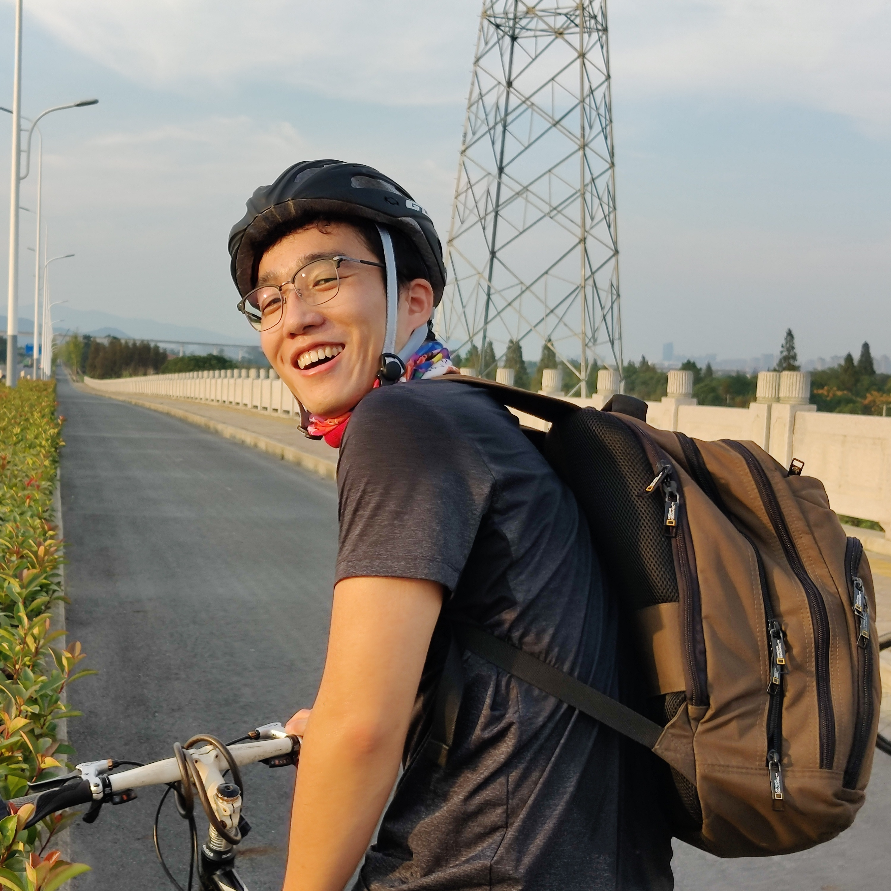

# 
 Kunyi Zhang's homepage

<left>
    
     
    
[kunyizhang@zju.edu.cn]
  	

</left>

<body>
  

    <h1>Zhepei Wang</h1>
    

      

        
        
[<a href="mailto:wangzhepei@live.com">wangzhepei@live.com</a>
          | <a href="https://github.com/ZhepeiWang">github</a>]

      

      

        
Hey, my name is Zhepei. I'm passionate about autonomous vehicles, mathematical programming, and computational
          geometry.
          I received my Ph.D. degree in Control Science and Engineering from the <a
            href="http://www.zju.edu.cn/">Zhejiang University</a>
          in 2022, for my work on motion planning for flying robots under the supervision of
          <a href="https://scholar.google.com/citations?user=4RObDv0AAAAJ&hl=en&oi=ao">Fei Gao</a> and
          <a href="https://person.zju.edu.cn/xu">Chao Xu</a> at the <a href="http://zju-fast.com/">ZJU-FAST-Lab</a>.
          I received my B.Eng. degree in Automation from the <a href="http://www.cse.zju.edu.cn/">College of Control
            Science and
            Engineering</a>, Zhejiang University, in 2017.
        

        
Selected: <a href="https://github.com/ZJU-FAST-Lab/GCOPTER">
            A General-Purpose Trajectory Optimizer for Multicopters</a>

        <a href="https://github.com/ZJU-FAST-Lab/GCOPTER" target="blank">
          

            
          

        </a>
      

    

  

                      
                      
Hello there, I am Kunyi Zhang (张焜怡), currently a Ph.D candidate at [ZJU Fast Lab](http://www.kivact.com/), supervised by Prof. [Fei Gao](https://ustfei.com/) and Prof. [Chao Xu](https://person.zju.edu.cn/xu). 
During these years, I have been developing visual inertal odometry, LIDAR SLAM, multi sensor fusion for robot autonomous navigation. 

I received my Bachelor's Degree of Engineering from [School of Mechanical and Power Engineering](https://mech.ecust.edu.cn/) and Bachelor's Degree of Science from [School of Mathematics](https://math.ecust.edu.cn/) at [East China University of Science and Technology (ECUST)](https://www.ecust.edu.cn/main.htm) in 2016.
I then started my master's program and a successive doctoral program at [College of Control Science and Engineering (CSE)](http://www.cse.zju.edu.cn/), [ZheJiang University (ZJU)](https://www.zju.edu.cn/english/) in 2017. 

I used to work as an intern in the Mapping Group of the Automated Driving Division of Dharma Academy, and now I am also working as an intern in the
I also worked as an intern in the mapping group of  [Autonomous Driving Lab](https://damo.alibaba.com/labs/intelligent-transportation/?lang=en) at
[Alibaba DAMO Academy](https://damo.alibaba.com/) (2022.01-2022.07), and now I am also working as an intern at [Zhejiang Yangtze River Delta Feiyang Intelligent Technology Center](http://iie.zju.edu.cn/) in the Collaborative Technology Department (2020.07-now).

## Publications
* __Kunyi Zhang__, Chenxing Jiang, Jinghang Li, Sheng Yang, Teng Ma, Chao Xu, Fei Gao, __DIDO: Deep Inertial Quadrotor Dynamical Odometry__. Published by _IEEE Robotics and Automation Letters (RA-L), 2022_.
[[Paper](https://ieeexplore.ieee.org/document/9817624) |
[Video](https://www.bilibili.com/video/BV1dU4y1Z773?spm_id_from=333.999.0.0) |
[Code](https://github.com/zhangkunyi/DIDO/)]

* __Kunyi Zhang__, Tiankai Yang, Ziming Ding, Sheng Yang, Teng Ma, Mingyang Li, Chao Xu, Fei Gao, __The Visual-Inertial- Dynamical Multirotor Dataset__. Published by _International Conference on Robotics and Automation (ICRA), 2022_. 
[[Paper](https://ieeexplore.ieee.org/document/9811956) | 
[Video](https://www.bilibili.com/video/BV1s54y1a7x2?spm_id_from=333.999.0.0&vd_source=d7b481ad934521dd1e529c999b807535) | 
[Code](https://github.com/ZJU-FAST-Lab/VID-Dataset)]

* Ziming Ding, Tiankai Yang, __Kunyi Zhang__, Chao Xu,Fei Gao, __VID-Fusion: Robust Visual-Inertial-Dynamics Odometry for Accurate External Force Estimation__.
Published by _International Conference on Robotics and Automation (ICRA), 2021_. 
[[Paper](https://ieeexplore.ieee.org/document/9560898) |
[Video](https://www.bilibili.com/video/BV1aZ4y1V7NF?spm_id_from=333.999.0.0&vd_source=d7b481ad934521dd1e529c999b807535) |
[Code](https://github.com/ZJU-FAST-Lab/VID-Fusion)]

*	__Kunyi Zhang__, Chenxing Jiang, Sheng Yang, Teng Ma, Chao Xu, Fei Gao, __WING: Wheel-Inertial-Neural Odometry with Ground Manifold__. 
Submitted to _IEEE International Conference on Robotics and Automation (ICRA), 2023_.

## Patents
* Unmanned aerial vehicle multi-battery pack charging circuit automatic switching device and method.
* Unmanned aerial vehicle battery replacement device and using method thereof.
* Grabbing device for replacing battery of unmanned aerial vehicle.

## Competitions and Awards
* The International Air Robotics Competition (IARC) in 2017, First Prize.
* The "Huawei Cup" Graduate Student Mathematical Modeling Competition in 2018, Second Prize.
* The "SUPCON" Scholarship, in 2017-2018 academic year.
* The International Air Robotics Competition (IARC) in 2018, First Prize&Champion.
